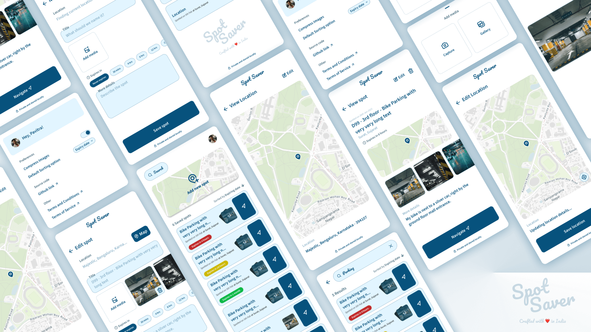

# SpotSaver

  

A utility app for saving and navigating locations. Features include requesting fine location permission, saving multiple locations with tags, navigating to saved spots via Maps, auto-delete options (e.g., 5 hrs, 1 week), and the ability to add a reference snap for each spot

## App Design
1. [Figma](https://www.figma.com/file/xg432xwCA8oyhtC7MlfUuv/Spot-Saver?type=design&node-id=0%3A1&mode=design&t=0Ii75XKmUnjcdV5T-1)
2. [Prototype](https://www.figma.com/proto/xg432xwCA8oyhtC7MlfUuv/Spot-Saver?page-id=0%3A1&type=design&node-id=1-2&viewport=-603%2C662%2C0.64&t=LMP8AwMt8L5TeGrj-1&scaling=scale-down&starting-point-node-id=1%3A2&mode=design)

## Contributors
Our rockstars 🤘   

## Helpful Live templates
Import [LiveTemplateScheme.zip](other/art/LiveTemplateScheme.zip) into Android studio to use below live templates:
1. (comp) Compose component with Preview: A composable function with preview function
2. (statepageui) Create page state interface: A interface with mutekt @GenerateMutableModel and default params (isLoading & error)

##### Steps to import:

1. File ➡️ Manage IDE settings ➡️ Import Settings
2. Locate [LiveTemplateScheme.zip](other/art/LiveTemplateScheme.zip)
3. Next check "Live templates" and press "Okay"
4. It'll ask to restart Android Studio, save and restart

## UI reference links
- [Dribble 1](https://dribbble.com/shots/6134302-Location-Tracker-Daily-UI-020?utm_source=Clipboard_Shot&utm_campaign=Lybimov&utm_content=Location%20Tracker%20-%20Daily%20UI%20%23020&utm_medium=Social_Share&utm_source=Clipboard_Shot&utm_campaign=Lybimov&utm_content=Location%20Tracker%20-%20Daily%20UI%20%23020&utm_medium=Social_Share)
- [Dribble 2](https://dribbble.com/shots/15559394-Location-Tracker-DailyUI-020?utm_source=Clipboard_Shot&utm_campaign=tddvsn&utm_content=Location%20Tracker%20-%20DailyUI%20-%20020&utm_medium=Social_Share&utm_source=Clipboard_Shot&utm_campaign=tddvsn&utm_content=Location%20Tracker%20-%20DailyUI%20-%20020&utm_medium=Social_Share)
